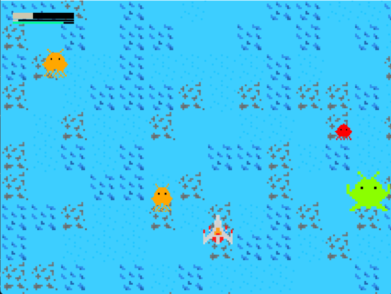

# Space Invaders Game
*Now you can fight with unkown civilization!*

## About
Space Invaders is the game I made for fun with the help of the pygame library in one week.

## Usage
To turn on the game after installing needed libraries (e.g. via pip) use command:
```
py main.py
```

## Short description
Space Invaders is a short 2D game consisted of three levels (+ one boss level), menu and short story related texts. I won't be precisely describing every element, because it would spoiler the game, wouldn't it?

## Music
When choosing music to my game I tried not to violate any of the copyright laws, but if - after all - I have violated any of them, please contact me to remove music from this repository.

## Sprites, graphic elements
All graphic elements (sprites, etc.) were created by me and if anybody wants to use them outside of this project, go ahead.

## Requirements
Libraries that are needed to successfully run the game are listed in the *requirements.txt* file.

## Gallery
Gameplay screenshot from the first level:


## Note
Please that this game (and sprites, music, etc.) with distance, because I'm really bad with making things like graphic elements, so I'm fully aware that this game looks... like it looks. But despite everything of this I believe anyone who will try to play it will have even a slight fun.

## Game state
**Game is fully finished (meaning all level, enemies, etc. should be properly working). Game could receive small bugfixes (if any will be found) in the future.**